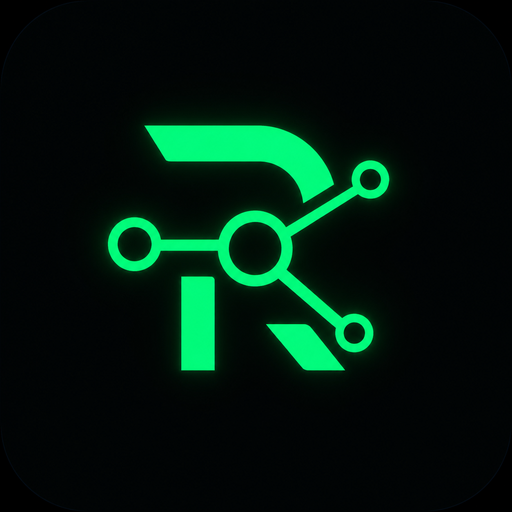
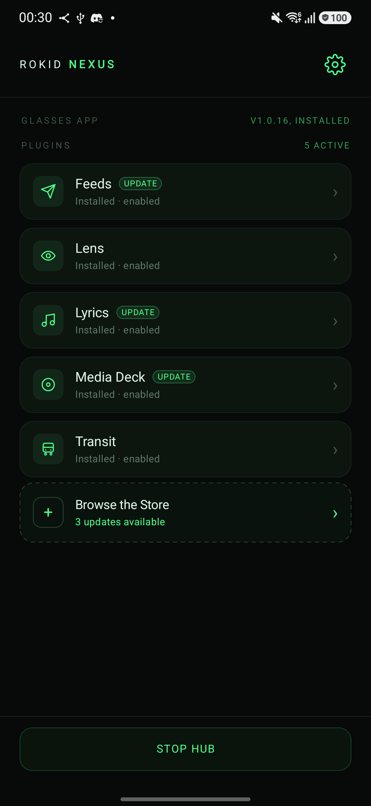
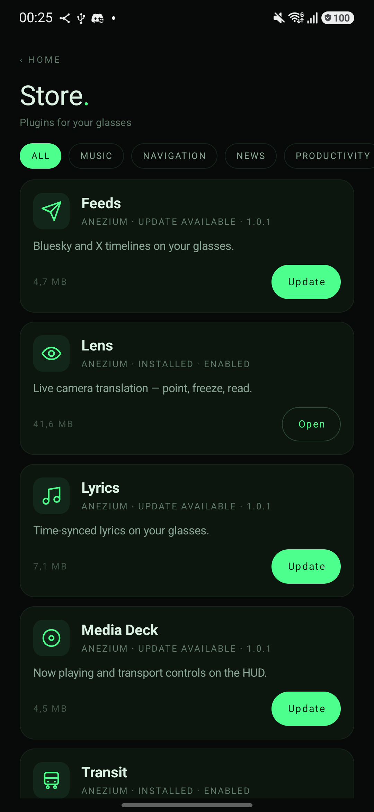
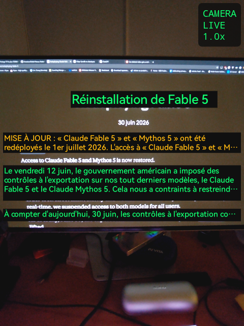
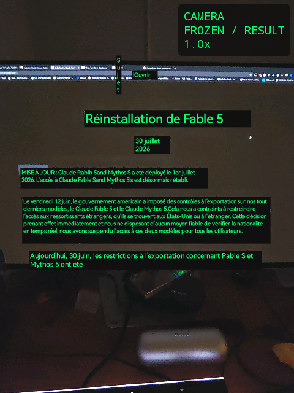
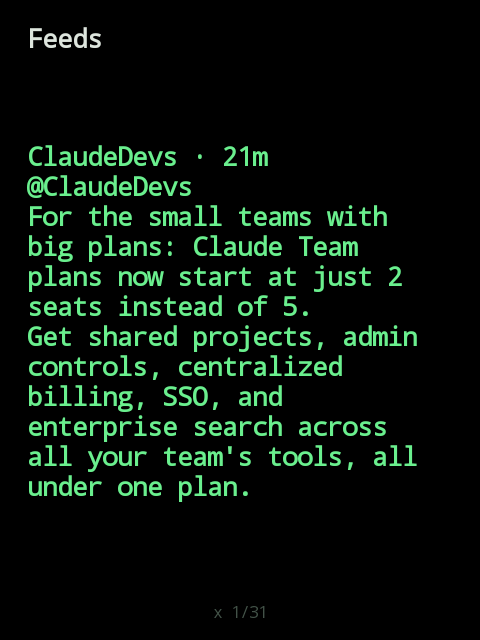
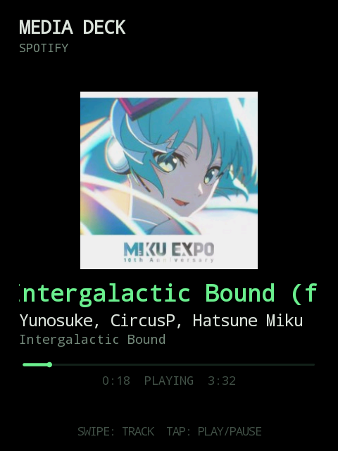
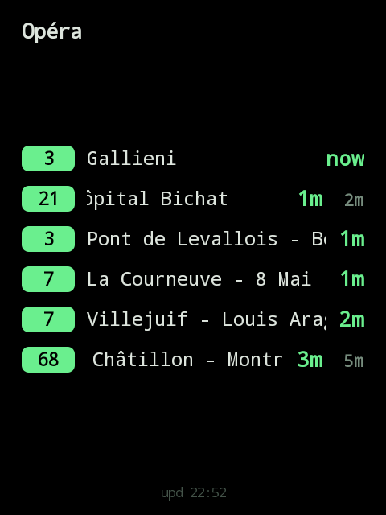
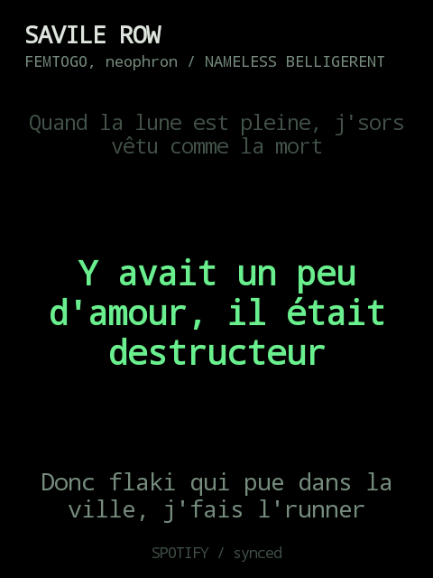

<p align="center">
  
</p>

<h1 align="center">Rokid Nexus</h1>

<p align="center"><b>Install a phone app, get a glasses app.</b></p>

<p align="center">
  <a href="https://github.com/Anezium/Rokid-Nexus/releases"></a>
  <a href="https://github.com/Anezium/Rokid-Nexus/releases?q=sdk"></a>
  
  
  
  <a href="LICENSE"></a>
</p>

<p align="center">
  <a href="https://ko-fi.com/M8R61ZTXMI" target="_blank">
    
  </a>
</p>

Rokid Nexus is a plugin platform for Rokid AR glasses: one permanent hub lives
on the glasses and renders everything; all features ship as ordinary Android
APKs on the phone. Nothing is ever installed on the glasses again.

Plugins stay isolated in their own processes, appear only after explicit user
approval, and draw on the HUD through declarative surfaces — cards, synced
timed lines, media decks, and real images.

## Plugins

| Plugin | What it puts on the HUD |
|---|---|
| **[Lens](plugins/lens/)** | Google-Lens-style live translation: the glasses camera streams to the phone, ML Kit OCR + translation run there (offline), translated overlays come back in real time — plus a freeze mode for full-resolution stills |
| **[Feeds](plugin-feeds/)** | Bluesky and X timelines — browse posts, open threads, and view the actual photos full-screen |
| **[Transit](plugins/transit/)** | Nearby stops and live departures (Transitous/MOTIS), with favourites |
| **[Lyrics](plugins/lyrics/)** | Time-synced lyrics for whatever is playing on the phone, from Spotify/Musixmatch/Netease/LrcLib |
| **[Media Deck](plugins/media/)** | Universal now-playing surface with album art and transport controls |
| **[Sample](plugins/sample/)** | Minimal copyable reference plugin |

All of them install from the in-app **Nexus Store**, backed by the public
[RokidBrew-Registry](https://github.com/Anezium/RokidBrew-Registry) feed with
SHA-256 and signer pinning enforced before every install, and show update
badges when a newer release is published.

## Screenshots

### Phone app

<p align="center">
  
  &nbsp;
  
</p>

<p align="center"><i>The phone hub: your plugins, glasses-app status, and one-tap updates — and the Store they install from.</i></p>

### Plugins on the HUD

<p align="center">
  
  &nbsp;
  
</p>

<p align="center"><i>Lens — live translation streamed to the phone and back, plus a freeze mode for full-resolution stills.</i></p>

<p align="center">
  
  &nbsp;
  
</p>

<p align="center"><i>Feeds — Bluesky and X timelines. &nbsp;·&nbsp; Media Deck — now playing with album art and transport.</i></p>

<p align="center">
  
  &nbsp;
  
</p>

<p align="center"><i>Transit — nearby stops and live departures. &nbsp;·&nbsp; Lyrics — time-synced to whatever is playing.</i></p>

## Setup — a phone is all you need

1. Install the Nexus phone app from this repository's
   [releases](https://github.com/Anezium/Rokid-Nexus/releases).
2. Follow the onboarding: seven in-context steps, including pushing the
   glasses app over the Rokid link — no cable, no PC.
3. On the glasses, enable the accessibility service when asked. Nexus
   bootstraps the rest of its glasses-side setup by itself.
4. Install your first plugin from the Store.

Both apps keep themselves current afterwards: the phone updates from GitHub
releases, the glasses update over the Rokid link, plugins update through the
Store.

Trust model: any APK may request bus access, but capabilities (`surfaces`,
`http_proxy`, `microphone`, `camera`) are granted per plugin by the user, keyed
to package + plugin id + signing certificate. Installation alone never grants
anything. Developer mode adds package, signer, protocol, and route diagnostics
plus a live bus inspector.

## Build a plugin

A plugin is a headless phone APK against the published SDK:

```kotlin
repositories { maven("https://jitpack.io") }

dependencies {
    implementation("com.github.Anezium.Rokid-Nexus:bus-client:sdk-v0.1.1")
}
```

Start with [plugins/AGENTS.md](plugins/AGENTS.md) — the complete,
self-contained plugin contract — then [docs/PLUGIN_SDK.md](docs/PLUGIN_SDK.md)
(SDK reference) and [docs/PLUGINS.md](docs/PLUGINS.md) (structure + design
kit). [plugins/sample](plugins/sample/) is the canonical template. Publishing
is F-Droid-like: host the APK on your own releases, PR a manifest to the
registry ([plugins/README.md](plugins/README.md)).

## Repository layout

- `shared`: wire envelopes, paths, descriptors, capabilities, and route rules.
- `bus-client`: the public Android SDK — `NexusPluginService`, lifecycle
  callbacks, typed card/timed-lines/media/image surfaces, the NexusUi design
  kit, and explicit hub targeting.
- `phone-hub`: discovery, consent, identity enforcement, the Nexus Store, app
  self-update, and the Rokid link.
- `glasses-hub`: the single HUD renderer/launcher anchor, the camera platform,
  and the no-PC self-arm onboarding.
- `plugins/` and `plugin-feeds/`: the plugin APKs, one folder per plugin with
  its README and CHANGELOG.
- `phone-client-probe` and `glasses-client-probe`: validation modules.

## Local build

Use JDK 17 and the checked-in Gradle wrapper:

```powershell
.\gradlew.bat test lintDebug assembleDebug
.\gradlew.bat :shared:publishToMavenLocal :bus-client:publishToMavenLocal '-PversionName=0.1.0-SNAPSHOT'
.\gradlew.bat :plugin-sample:assembleDebug '-PusePublishedSdk=true' '-PversionName=0.1.0-SNAPSHOT'
```

The local `CxrGlobal` composite is used only when its sibling directory exists.
SDK publication and the published-coordinate sample build do not require it.

## More

[Product vision](VISION.md) · [wire specification](BUSSPEC.md) ·
[protocol guide](docs/PROTOCOL.md) · [verification matrix](TESTPLAN.md)

This project is licensed under the [Apache License 2.0](LICENSE).
